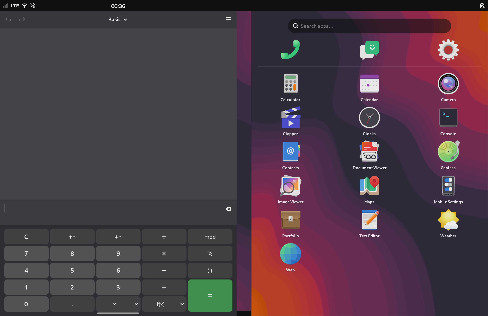
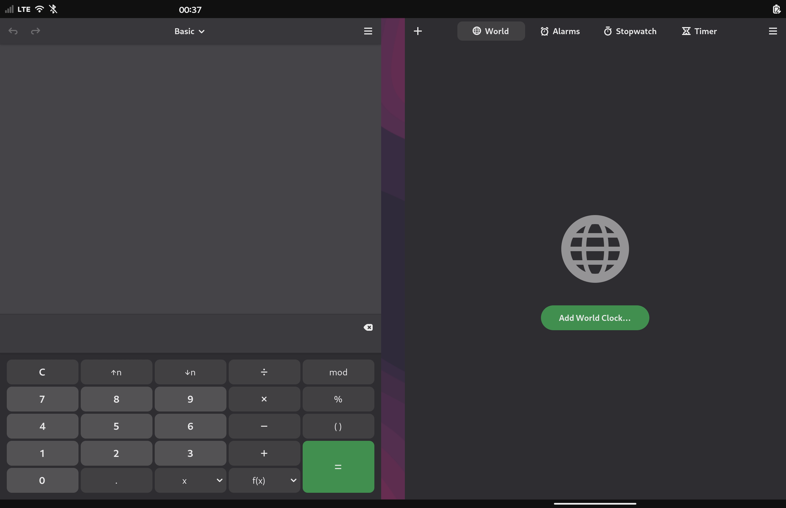
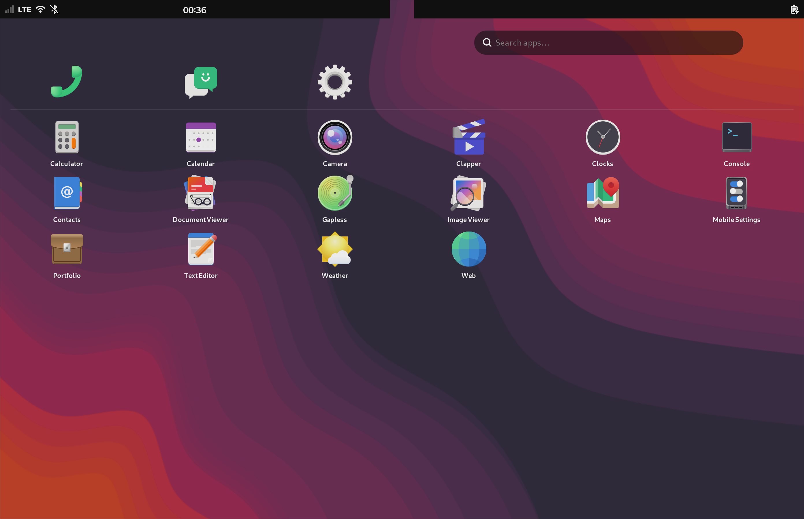
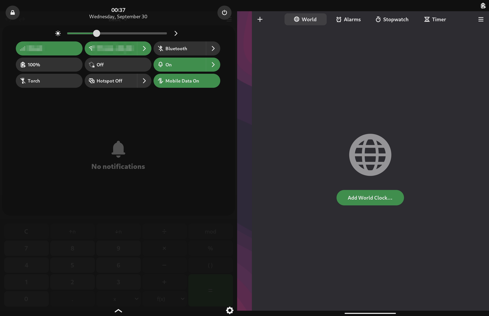
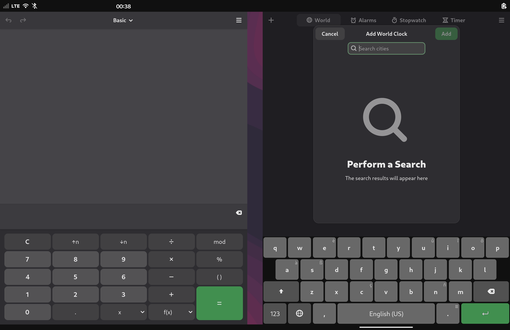
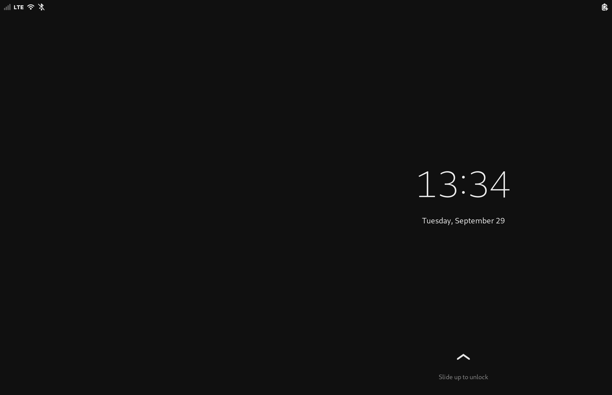

# Droidian on Microsoft Surface Duo 1

> **This repository is the port: the hardware and the system.** It runs
> Droidian's own shell, with only the fixes the hinge's seam needs. The
> two-panel shell for this phone is [item](https://github.com/agentsco-lab/item),
> a compositor of its own installed on top of the port;
> [item/grid](https://github.com/agentsco-lab/itemgrid) installs the port and
> item on a Duo from a Linux computer. Up to 0.20.x the port carried the
> two-panel shell itself (item-shell 0.1).

**An independent Linux port for the Microsoft Surface Duo 1** - Debian
arm64 (Droidian, Halium-based) running with both OLED panels and touch,
reusing the stock Android 11 vendor HALs via libhybris. Port bring-up
July 2026.

> **⚠️ READ THE SAFETY GUIDE FIRST.** The Surface Duo has **no public
> emergency-download (EDL) loader** - a bad flash can permanently brick
> it, with no software recovery path. This port is built around that
> constraint: everything goes through gated tooling
> (`tools/flash-safely.sh`), RAM-boot before any flash, one change per
> boot cycle. See [docs/SAFETY.md](docs/SAFETY.md). If you skip it, you
> accept the risk of a paperweight.

A boot to a fully working system (both panels, touch, Wi-Fi, the modem) is
hands-off: on 0.20.1 the lock screen comes 22 s after the kernel starts
(stock Android on the same phone: 14 s; 0.20: 48 s).

## What it looks like

Screenshots of the one output both panels share (2784x1800; the 84 px column
the hinge hides is in the middle), taken on 0.21.0 at the port's output
scale of 2: Droidian's own shell, with the fixes the seam needs.

| | |
|---|---|
|  |  |
| A window on one panel and the free one as its desktop: the app grid in three columns, the wallpaper to the bottom edge. An app started from it opens on that panel; the handle under the window pulls the overview up. | A window on each panel, each maximized to its own. |
|  |  |
| Nothing open: the app grid across both panels, six columns with the hinge between the third and the fourth, and a top bar per half. | A shade per half, each pulled down on its own and neither cut in two by the hinge. |
|  |  |
| The on-screen keyboard on one panel - the right one - instead of across the hinge. | The lock screen, its clock on the right panel. |

The two-panel shell - a dock across both panels, windows tiled to the panel
they were launched from, the hinge, the pen, CV ID - is item, a compositor
of its own on top of the port: [agentsco-lab/item](https://github.com/agentsco-lab/item),
with a minute of film and its screenshots.

## Status (0.22.0 on Droidian 102)

The rows were checked on 0.21.0 (2026-09-29). 0.22.0 (2026-10-09) changed
the sleep - a phone shut sleeps the night, Wi-Fi up, about 1.3 % an hour -
and mended Flatpak; its [release notes](https://github.com/agentsco-lab/surfaceduo-droidian/releases/tag/v0.22.0)
have the measurements.

| Subsystem | Status | Notes |
|---|---|---|
| Boot (RAM-boot) | ✅ | `fastboot boot`, no flashing required for testing |
| Both displays | ✅ | Phosh session, panel power management works; output scale 2 (1392x900 logical) since 0.15.4: GTK3 has no fractional scale, and at 2.5 (Android's density, 0.14.1-0.15.3) it drew at 3 and the lock screen ran at 40 fps; at 2 it runs at 60 (`docs/PERF.md`) - Droidian's generic 3 gave a phone's worth of space |
| Touch | ✅ | MS D5 controller: kernel spi-hid → vendor HAL → uinput + udev rule |
| USB networking + ssh | ✅ | RNDIS gadget, 172.16.42.1 |
| System stability | ✅ | unlimited uptime once the ADSP is booted at start (adaptation handles it) |
| WiFi | ✅ | qcacld-3.0 built from Microsoft's OSS wlan repos against this kernel; autoloaded by the adaptation package; NetworkManager just works |
| Hinge angle (posture!) | ✅ | MS sns_fold on the SLPI via the sensorfw patch in this repo - live degrees over DBus. The rebuilt sensorfw is carried by the package and installed by `sudo sfduo-sensorfw-install` (one step after the package; dpkg cannot do it from postinst) |
| Audio | ✅ | 23 techpack modules from MS OSS + ADSP boot ordering; PulseAudio/droid picks the card up; TTS spoken through the speaker |
| Bluetooth | ✅ | bluebinder exonerated (the lockup was dead-ADSP collateral); needs the timeout drop-in + a provided board-address |
| Camera | ✅ | droidian-camera (QT_QPA_PLATFORM=wayland) - full 11MP stills |
| Fingerprint | ✅ | droidian-fpd; enrol in the settings, unlock by finger via sfduo-fingerprint whenever the locked screen is lit |
| Suspend | ✅ | dwc3-msm kernel patch + sleep hook + AllowSuspend override; wake = long power press; RTC-through-sleep pending |
| Flashlight / vibration | ✅ | sysfs LEDs (video group via udev); da7280 (FF_CONSTANT only) |
| Pen (stylus) | ✅ | a stylus to applications since 0.20: `sfduo-pen-split` splits the digitizer into the fingers' touchscreen and a pen with pressure, eraser and button, and a sheet to draw on comes in from the right edge (swipe left on the free right panel). Tested with a Metapen; [docs/PEN.md](docs/PEN.md) |
| Brightness | ✅ | the phosh slider drives both panels (udev change-event sync); auto-brightness pending (ALS already works) |
| Fold | ✅ | hall sensor (GPIO 121) → SW_LID bridge → logind. Since 0.13 a fold locks rather than suspends (suspend is off in the session; to have it back see [adaptation/system](adaptation/system/README.md)); since 0.17 it also turns the display off: closed on battery 33-55 mA against 126-184 mA with the panels left lit, and a 4-hour measurement closed on battery went from 97 % to 89 % (53-57 mA, about 2 % an hour) |
| GPS | ✅ | vendor GNSS + geoclue hybris source, ~4 m fixes; needs the geoclue keepalive drop-in from the adaptation (see traps below) |
| Modem (calls/SMS/LTE) | ✅ | Calls and SMS both ways, LTE data (70-90 ms pings). The adaptation puts the modem online and on LTE at boot - it comes up offline and on 3G otherwise - and keeps it there: since 0.20.1 also when Droidian's mobile-power-saver asks it for 5G, which the Duo 1 does not have (the modem sat on 3G and never slept). See [adaptation/system](adaptation/system/README.md) |
| Video out (USB-C DP) | ❓ | the whole DisplayPort path sits in the stock device tree and probes cleanly; whether the lanes reach the connector has never been tested - see below |
| Dual-screen aware UI | ✅ | Droidian's own shell, taught about the hinge: a top bar and a shade per half, windows maximized one panel each and opened on the panel touched last, the keyboard, the notification banners, the volume bubble and the launch splash on one panel, the app grid in six columns clear of the hinge - patched phosh, phoc and phosh-osk-stevia and a stylesheet, see [adaptation/shell](adaptation/shell/README.md). The two-panel shell - a dock across both panels, windows tiled to the panel they were launched from, the system screen and the pen's sheet - is item, a compositor of its own on top of the port, from [agentsco-lab/item](https://github.com/agentsco-lab/item) (item-shell 0.1 was part of the port up to 0.20) |

## Speed

Opening an app, from the request to its first frame, on the same Surface Duo 1
(median of 10, ms):

| | stock Android 12L | 0.20.1 on Droidian 102 | 0.20 on Droidian 102 | 0.18 on Droidian 101 |
|---|---|---|---|---|
| Settings | 368 | 704 | 794 | 1166 |
| Calculator | 340 | 573 | 687 | 1045 |
| Contacts | 413 | 561 | 649 | 1022 |
| Camera | 308 | 832 | 935 | 1332 |
| Browser | 507 (Edge) | 1202 (GNOME Web) | 1289 (GNOME Web) | 2339 (Firefox) |
| Calendar | 584 (Outlook) | 1572 | 1747 | 2038 |
| Clock, already running | 92 | 59 | 59 | 135 |
| Phone, already running | 92 | 59 | 59 | 303 |
| Messages, already running | 121 | 133 | 133 | 242 |
| A minimized app back from the dock | - | 59 | 59 | 444-491 |
| Opening the app grid, frames dropped | 2 | 0 | 0 | 0 |
| Boot, kernel start to the lock screen, s | 13.75 | 22.3 | 47.7 | - |
| Closed phone, battery draw, mA | - | 46-48 | 35-65; 74 with the modem on 3G | 58 (6-hour average) |

0.20.1 opens apps 7-21 % faster than 0.20 (the launch boost now does what
Android's does for the 2 s after a tap), boots in half the time (no search for
an LVM volume, and no serial console nobody reads - the kernel waited for it),
and a closed phone stays at 46-48 mA instead of drifting to 74 (the modem no
longer sits on 3G asking for 5G it does not have). Stock Android still opens apps about 1.5-2x as fast.
Rows 0.20.1 did not change are carried over from 0.20. These were taken with
the two-panel shell, which launched the apps through its dock; 0.21 runs
Droidian's own shell with the same launch boost, and its own
numbers come once the bench can launch without the dock. All the numbers, the
Surface Duo 2 beside them, and how they are taken:
[docs/SPEED.md](docs/SPEED.md).

## Repository layout

- `kernel-packaging/` - Droidian-style packaging for the
  [Microsoft OSS kernel](https://github.com/microsoft/surface-duo-oss)
  (branch `surfaceduo/11/2022.902.48`): `debian/`, the device config
  fragment, kernel patches (`patches/` - suspend fix, log-noise fix,
  audio build fixups), build instructions (containerized, reproducible).
- `adaptation/` - the `adaptation-droidian-surfaceduo` package: USB
  access, offline sshd bundle, touch udev rule, wlan/audio module
  loading with ADSP boot ordering, hinge sensor config, suspend hooks,
  bluetooth bring-up (timeout + board-address), geoclue/GPS drop-in.
- `adaptation/system/` - the slot guard that keeps the bootloader on slot
  A, the lid policy (closing the device locks it), panel power without the
  compositor.
- `adaptation/shell/` - Droidian's shell on two panels: patches for phosh,
  phoc and the on-screen keyboard where they meet the hinge's seam, the CSS
  that moves everything the shell centres off it, the output scale, and the
  install scripts that put the patched programs in place (its own README
  covers the mechanisms and the traps).
- `sensorfw-hinge-patch/` - hinge-angle sensor support for sensorfw
  (its own README covers build + install).
- `docs/` - port guide + **the safety protocol** + `STOCK-ANDROID.md`, to
  stock Android and back + `SPEED.md`, the port against stock Android + `APPS.md`, what an
  application has to know about this screen (the seam, rotation, touch as
  WebKit delivers it, the cost of a frame, profiling with symbols) +
  `PERF.md`, where a frame's time goes.
- `tools/` - `flash-safely.sh` (gated flash pipeline: offline image
  validation, per-serial attempt limits, health baselines,
  brick-signature detection), vendored AOSP mkbootimg, stock-DTB
  extraction, parking-brake image maker.

## Quickstart (experienced porters)

1. Unlock the bootloader (Microsoft's official process).
2. Back up `boot_a`, `boot_b`, `misc` from a booted TWRP
   (RAM-boot only - never flash TWRP).
3. Extract the stock DTB from **your own** backup:
   `tools/extract-stock-dtb.sh boot_b.img` (device blobs are not
   redistributed here).
4. Build the kernel (`kernel-packaging/README.md`), pack the boot image
   with the stock DTB, `tools/flash-safely.sh validate` it.
5. Install the **Droidian 102** nightly rootfs (`rootfs api30 arm64`,
   phosh phone) from TWRP: only `data/rootfs.img` from the zip - never
   flash the zip - grown to 8 GB. Put the release's `.deb` in `out/` and
   inject it with `adaptation/ssh/inject-ssh-twrp.sh`. On Droidian 101,
   0.18.0 is the release to use. Or take the ready-made image - Droidian
   102, this port and item, built by `tools/build-release-image.sh` - from
   [item's releases](https://github.com/agentsco-lab/item/releases)
   (`item-duo1-…`, with the kernel and the recovery), which is what
   item/grid installs.
6. `tools/flash-safely.sh ram-boot` - **RAM-boot only** until you have
   many boring-stable cycles behind you.
7. The first boot installs the package and **reboots once, into
   fastboot**; RAM-boot the same image again, and that is the real one.
   Connect to Wi-Fi, run `sudo sfduo-shell-setup` and reboot: the pen
   and the full-size root filesystem come with it. The two-panel shell, item,
   goes on top if you want it: `sudo apt install ./item_<version>_arm64.deb`
   and `sudo item-switch item`, from
   [agentsco-lab/item](https://github.com/agentsco-lab/item). Or let
   [item/grid](https://github.com/agentsco-lab/itemgrid) do all of this from
   a Linux computer.

This path was run end to end on an untouched Droidian 102 nightly
(2026-09-27) with the 0.20 package; what it found is in the 0.20.0 notes.
The first boot's reboot into fastboot came after that run and was tried on
its own.

Full walkthrough: [docs/PORT-GUIDE.md](docs/PORT-GUIDE.md). Back to stock
Android and from it to the port: [docs/STOCK-ANDROID.md](docs/STOCK-ANDROID.md).

## Known kernel traps (the expensive lessons)

- **DTB scheme**: ship the GENERIC wildcard SoC DTB (as stock does) and
  let ABL merge the stock `dtbo` overlay. Shipping the per-board DTBs
  from `dts/surface/` silent-kills early boot (retail board-id is not
  among them).
- **BCB poison**: if stock Android ever normal-boots while a foreign
  rootfs sits on userdata, it writes `boot-recovery --prompt_and_wipe_data`
  into `misc`, after which ABL rejects *everything* per-slot. Cure:
  zero the first 2 KB of misc from TWRP. Prevention: a one-shot
  `bootonce-bootloader` BCB "parking brake" before every risky step.
- **Per-slot RAM-boot wedge**: after a crashed RAM-boot a slot may
  reject all further RAM-boots ("Device Error") while its getvars stay
  pristine. Switch slots; never retry a crashed kernel from your last
  good slot.
- **bluebinder false villain**: under a dead-ADSP/daemon-spin storm it
  soft-locks the kernel (`queued_write_lock_slowpath`) and takes all I/O
  down - but on a healthy system it is fine. The real fixes are a longer
  start timeout (chip re-init ≈65 s) and a pre-provided
  `/var/lib/bluetooth/board-address` (the Duo exposes no bdaddr
  property). Both ship in the adaptation package.
- **The Android ext4 `umount_end` hook** (patches/0004; likely affects
  every Halium port with a loop rootfs on an msm-4.14 kernel) - ONE
  downstream hook, TWO symptom classes. On every user umount(2) with
  the superblock still active in another namespace (i.e. on every
  systemd mount-namespace teardown of the root) it synchronously
  rewrote the live superblock and flipped the error policy to
  remount-ro. Symptom A: any unit with mount-namespace sandboxing
  (`ProtectSystem`, `PrivateTmp`, …) took ~40 s to spawn (geoclue was
  the visible victim - DBus activation times out at 25 s, so GPS looked
  dead while the GNSS stack was fine); with the hook removed the same
  unit spawns in 0.2 s. Symptom B: harmless journald write hiccups
  escalated into a read-only root - the phone "freezes" but still
  pings. Full evidence: `docs/FREEZE-FORENSICS.md`.
- **plymouth vs the vendor composer** (the classic first-boot failure:
  black screens right after the Debian logo): droidian ships plymouth.
  Depending on the install it may draw its splash or nothing at all,
  but either way it takes DRM master on /dev/dri/card0 at boot. When
  the boot is slow enough that the android container brings the
  composer up while plymouthd is still alive, the composer opens the
  device non-master and stays that way after plymouth quits: both
  panels black with the backlight on, phoc spams
  "validate failed for display 0: 2", logcat shows EACCES on
  drmModeAtomicCommit, the power key seems dead. The adaptation ships
  `sfduo-composer-watchdog` (detects the state and bounces the
  composer; note `setprop ctl.restart` does not restart it, only a
  kill does). On unencrypted installs `systemctl mask
  plymouth-start.service` removes the race entirely.
- **`data=journal` on userdata** (patches/0005): the halium initramfs
  mounts the ext4 userdata with `data=journal` (a 2014 UT workaround).
  With a loop rootfs on top, every root write double-writes through
  the outer journal; under bursts (`dpkg -i` is enough) jbd2 starves
  and the system stalls for minutes. `data=ordered` survives a 300 MB
  fsync burst with zero errors.
- **Page poisoning on by default**: Microsoft's defconfig ships
  `CONFIG_PAGE_POISONING` and `CONFIG_DEBUG_PAGEALLOC` with their
  `_ENABLE_DEFAULT` set, so every page freed is filled with a pattern,
  every page allocated is verified byte by byte, and the mapping is torn
  down and rebuilt each time (`memchr_inv`, `set_memory_valid`,
  `try_charge` in any perf profile). It taxes every allocation the
  device makes. `page_poison=off debug_pagealloc=off` on the cmdline
  (in `kernel-info.mk` since 2026-09) measured 15 points of CPU across a
  WebKit app's two processes; ABL appends its own arguments, so they
  arrive - check `/proc/cmdline`.
- **The defconfig is Microsoft's debug one**: page poisoning is one of 96
  options by which `vendor/surfaceduo_defconfig` - what this port builds -
  differs from `vendor/surfaceduo-perf_defconfig` in the same tree, and
  nearly all of them are debugging: `SLUB_DEBUG_ON` (on the device every
  slab cache reads `sanity_checks`, `red_zone`, `poison` and `store_user`
  = 1), `DEBUG_OBJECTS`, `DEBUG_KMEMLEAK`, `DEBUG_SPINLOCK`,
  `DEBUG_MUTEXES`, `DEBUG_LIST`, fault injection. What it seemed to cost:
  `systemctl daemon-reload` at 26-30 s every time, an ssh login that has to
  start a user manager at 27 s, a package
  postinst that enables a dozen units took nine minutes. **Most of that was
  not the kernel**: it was measured with the screen off, and Droidian's
  mobile-power-saver puts every core on the `powersave` governor while the
  screen is off - and, it turned out, from boot until the screen has been
  turned off and on once, and again for 300 s out of every 330 s after any
  `StopDozing` call, which headphone-manager makes on every USB-C plug (the
  package keeps the governor right while the screen is on since 0.15.1, see
  `adaptation/system/sfduo-cpufreq`). With the screen on and the governor where it
  belongs, the debug kernel does `daemon-reload` in 2.2 s. What the
  debugging really costs, measured the same way on both kernels
  (2026-09-18): 3000 `fork`+`exec` take 26 s against 11 s, a boot reaches
  ssh in about twice the time, and Slab holds 605 MB against 182 MB.
  Microsoft's perf defconfig is not the fix: it also drops what the port
  stands on (the backlight class, the GENI console, serdev). The fix is
  `kernel-packaging/droidian/surfaceduo-perf.config`, a fragment on top of
  the debug defconfig that turns off exactly the debugging - 92 config
  lines differ, all of them debug options. The release string is
  `4.14-190-perf-microsoft-surfaceduo`: the module ABI differs from the
  debug builds (`DEBUG_SPINLOCK` and friends change struct layouts), so the
  adaptation package carries wlan and audio modules per kernel release
  (`/usr/lib/sfduo/modules/<uname -r>/`) and the units pick the set for the
  running kernel.
- **GL for applications lands on llvmpipe**: `/usr/share/glvnd/egl_vendor.d/`
  registers only mesa, and mesa has no driver for this kernel, so any
  client that asks glvnd for EGL (WebKitGTK's WebGL, for one) gets the
  software rasteriser - eight `llvmpipe` threads - even though
  `libEGL_adreno.so` is already mapped into the process. A vendor JSON
  naming `libEGL_libhybris.so.0` and `__EGL_VENDOR_LIBRARY_FILENAMES`
  pointing at it puts the client on the GPU. Two things go with it: the
  app must inherit the session environment (`LD_PRELOAD=libtls-padding.so`
  above all - without it hybris cannot find Android's `libEGL.so` and
  the process falls to software and dies), and WebKit's dmabuf renderer
  stays disabled as the session has it: with mesa it measured 3x worse,
  with hybris it is indistinguishable from shared memory.

- **The serial console nobody reads**: the stock command line carries
  `console=ttyMSM0,115200n8 earlycon=msm_geni_serial,...`, and the Duo has no
  UART on the outside. Every kernel message still waited for it at 115200
  baud: `msm_geni_serial_init` took 3.6 s replaying the boot log when the
  console came up, and the rest of the boot was held up with it - the kernel
  reached the initramfs at 9.7 s. Without the two arguments (in
  `kernel-info.mk` since 0.20.1) it gets there at 1.6 s, and the lock screen
  comes 22 s after the kernel starts instead of 36. dmesg and the journal keep
  every message. Found with `initcall_debug`; note that the Duo's bootloader
  ignores the boot header's extra command line field - arguments have to go in
  the main one.

## Open question: video out over USB-C

No display has ever been plugged into this device under Linux, but the
whole DisplayPort path is present in Microsoft's own device tree and
comes up cleanly:

- `msm_drm` binds `qcom,dp_display@0`, and `mdss_pll_probe` reports
  "MDSS DP PLL"
- DRM exposes a connector, `card0-DP-1`, sitting at `disconnected`
- the DP AUX channel is registered as a real i2c adapter (`i2c-3:
  sde_dp_aux`)
- there is a DisplayPort audio DAI, `qcom,msm-dai-q6-dp`
- an FSA4480 SBU mux sits on i2c-0, which is the path AUX would take

What is unknown is whether the lanes physically reach the USB-C
connector. That part is a hardware question and can be answered on any
OS: if a passive DP alt mode adapter produces a picture under Android
or Windows, the lanes exist and the rest is a driver matter.

Under this port the check takes two minutes with a passive USB-C to
HDMI adapter:

```
cat /sys/class/drm/card0-DP-1/status      # "connected" = the lanes are there
dmesg -w | grep -iE 'dp_display|usbpd'
```

A report either way would settle it.

## Credits

- Microsoft for the OSS kernel drop.
- The Droidian project - rootfs, packaging tooling, porting guide.
- **Tygerpro**, whose independent Ubuntu Touch/Halium port of the Duo
  proved this device could run Linux.
- The WOA-on-Duo community for collective knowledge about this
  wonderful, weird device.

## License

Kernel packaging and kernel patches: GPL-2.0 (matching the kernel).
Scripts and adaptation: MIT. Documentation: CC-BY-SA 4.0.
`tools/mkbootimg/` is vendored from AOSP (Apache-2.0).
See `LICENSES/`.
